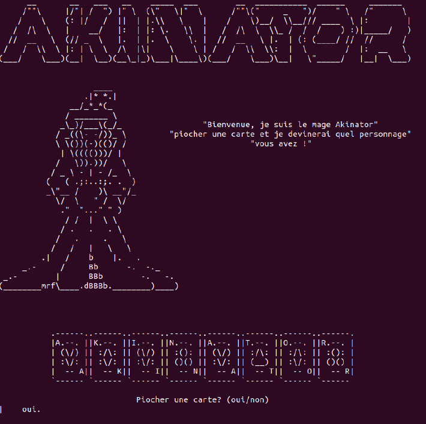
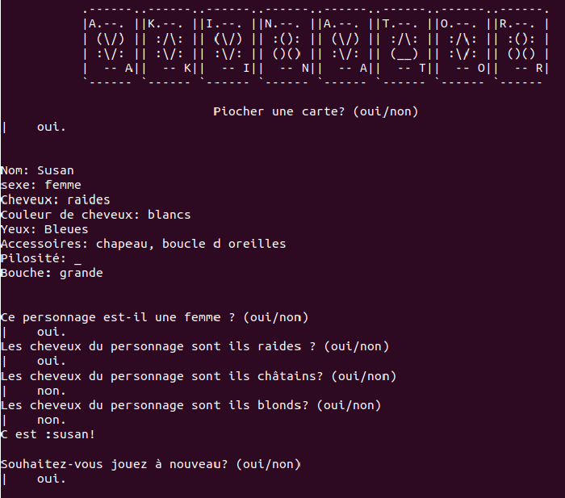
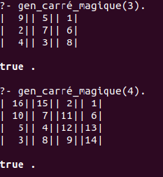
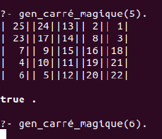

# Logic Programming & Inference Engines (Prolog)
*Expert Systems and Constraint Satisfaction Problems (CSP)*

*Paris 8 University (Bachelor Legacy) 2020 Original Development*  
 
*2026 Refactored for Translation*  

---

## 📌 Overview
This repository showcases the power of the **declarative paradigm** through two distinct applications developed in **SWI-Prolog**.

Unlike imperative programming, these projects focus on defining formal relations and logic rules, allowing the Prolog engine to derive solutions through backtracking and constraint propagation. This work explores the dual nature of Prolog: as a **Symbolic Logic tool** (Akinator) and as a **Mathematical Constraint Solver** (Magic Square).


## 🧙‍♂️ Project 1: Akinator-like Expert System (akinator.pl)
An interactive inference engine designed to identify a mystery character based on user input through a series of logical queries.

* **Logic**: Implements a robust knowledge base of facts and attributes within a symbolic AI framework.

* **Inference**: Features adaptive filtering of possibilities via backtracking, using recursive queries to prune the search space in real-time based on user input (Yes/No).

* **Key Feature**: Demonstrates how rule-based logic can simulate human-like decision-making processes within an interactive CLI environment.

<p align="center">
   <table border="0">
      <tr>
         <td>
            
            <br><em>Akinator welcome</em>
            </td>
            <td>
            
            <br><em>Akinator game</em>
         </td>
      </tr>
   </table>
</p>


## ⬛ Project 2: Optimized Magic Square Solver (magic_square.pl)

A high-performance algorithm designed to solve the classic $N \times N$ Magic Square puzzle, where every row and column must sum to the same "Magic Constant".

* **Paradigm Shift**: Transitioned from a standard brute-force approach to **Constraint Logic Programming (CLP)**.

* **Engine**: Utilizes `library(clpfd)` (or `clp/bounds`) to efficiently handle high-dimensional search spaces.

* **Algorithm Strategy & Pruning**:
     * **Order $N^2$**: The solver manages a set of $N^2$ variables simultaneously.
     * **Search Space Reduction**: For a 3x3 square, the search space represents $9!$ (362,880) permutations. This engine implements **active constraint propagation**: it applies the Magic Constant constraint $M = \frac{n(n^2+1)}{2}$ *before* values are assigned.
     * **Innovation**: Unlike "test and fail" methods, this solver restricts variable domains dynamically. As soon as a value is placed, the domains of all related variables are restricted, preventing the engine from exploring mathematically impossible branches.
<p align="center">
   <table border="0">
      <tr>
         <td>
            
            <br><em>Magic square 4 & 3</em>
         </td>
         <td>
            
            <br><em>Magic square 5</em>
         </td>
      </tr>
   </table>
</p>

## 📝 Conclusion & Technical Value

This repository serves as a technical demonstration of how **Logic Programming** offers elegant solutions to specific engineering challenges by bridging the gap between human reasoning and mathematical optimization.

Through these implementations, the project highlights that the **Declarative Paradigm** remains a highly relevant and interesting tool for modern Software Architects. It offers unparalleled clarity and efficiency for specific classes of complex computational problems, such as expert systems, scheduling, and formal verification.


## 🛠️ Usage & Execution
Requires [SWI-Prolog](https://www.swi-prolog.org/).

1. Running the **Akinator Expert System**

To start the interactive inference engine:
```Prolog
swipl -s akinator.pl
```  
    
Once the Prolog interpreter is loaded, launch the game by typing:

```Prolog
?- akinator.
```

Follow the on-screen instructions to draw a card and answer the Mage's questions.

2. Running the **Magic Square Solver**

To find a solution for a magic square of order N:
```Prolog
swipl -s magic_square.pl
```

Once loaded, call the solver with the desired size (e.g., 3 for a 3x3 square):
```Prolog
?- gen_carré_magique(3).
```

The engine will use CLP(FD) to unify the matrix and display the formatted result.
